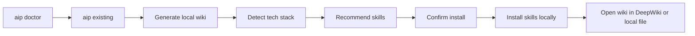
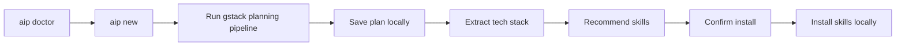

# AI Planner Local - CLI-First Execution Plan

## Final Product Decision

Current execution focuses on one product only:

- `AI Planner Local`

This MVP is now explicitly:

- local-first
- CLI-first
- designed for developers working on their own machines

`AI Planner Cloud` is deferred to a later phase.

## Primary Product Promise

AI Planner Local should help a developer do this with the fewest possible steps:

1. Set up AI Planner on a new machine.
2. Verify the machine can run required local tooling.
3. Run one CLI flow for an existing repo or a new idea.
4. Generate wiki or plan output locally.
5. Install the right skills into the local agent environment.
6. Continue work using those results immediately.

If this is not simpler than stitching together `DeepWiki`, `gstack`, and `npx skills` manually, the MVP is not done.

## Scope Decision

### In Scope

- Local CLI workflows
- Local setup and machine verification
- Existing project wiki generation
- New project planning
- Local skill recommendation and installation
- Thin optional web/wiki viewing support
- Opening or handing off wiki exploration to DeepWiki

### Out Of Scope

- Full web dashboard as the main product surface
- Shared hosted execution
- Team multi-user cloud workflows
- Remote local-machine access from a central server
- Rich AI Planner-owned wiki chat UI

## Product Shape

AI Planner Local should be a thin orchestrator around a few strong building blocks:

- `DeepWiki` for wiki generation and wiki browsing/chat
- `gstack` for planning workflows
- `npx skills` for local skill installation
- AI Planner core logic for orchestration, machine checks, tech detection, and local UX

The key idea is:

- do not rebuild what DeepWiki already does well
- do not rebuild what gstack already does well
- only add the glue needed to make the local workflow fast and reliable

## Main CLI Flows

### Flow A: Existing Project

### Flow B: New Project

## UX Principles

### 1. CLI is the product

The default happy path should be achievable from the terminal alone.

### 2. Setup is part of the product

The user should not need to reverse-engineer README steps to understand why the tool cannot run.

### 3. Web is optional, not foundational

If a web surface exists during this phase, it should only help with:

- viewing a generated wiki
- jumping into DeepWiki
- possibly reviewing artifacts

It should not be required for the main setup flow.

### 4. Reuse DeepWiki instead of rebuilding wiki UX

For wiki browsing, chat, and exploration:

- prefer opening DeepWiki directly
- store local markdown as a fallback artifact
- keep AI Planner's own wiki UI minimal

## MVP Workstreams

## Workstream 1: Bootstrap And Doctor

This is the top priority.

Goal:

- make fresh-machine setup predictable and self-diagnosing

Deliverables:

- `aip bootstrap`
- `aip doctor`
- machine readiness report
- clear failure messages and next actions

Checks should include:

- Node available and supported
- npm available
- Docker available
- Docker daemon running
- `npx skills` callable
- local agent target writable
- `.env` present or bootstrappable
- at least one LLM provider configured
- DeepWiki reachable

## Workstream 2: Existing Project CLI Flow

Goal:

- make `aip existing` the main value path for local repos

Deliverables:

- strong local path handling
- repo validation
- local wiki generation
- saved wiki artifact path
- tech detection merge
- skill recommendation
- install confirmation
- success summary with next actions
- option to open DeepWiki for wiki browsing/chat

## Workstream 3: New Project CLI Flow

Goal:

- keep planning useful, but simpler than a full UI product

Deliverables:

- `aip new`
- gstack-based planning orchestration
- local plan save path
- extracted tech stack summary
- skill recommendation and install
- clear end-state instructions

## Workstream 4: Thin Wiki Viewing Layer

Goal:

- avoid building a heavy custom wiki UI while still giving users a readable path

Deliverables:

- local markdown save output
- command or action to open generated wiki
- command or action to open DeepWiki
- optional lightweight web viewer only if it is nearly free to maintain

Success rule:

- DeepWiki is the primary browse/chat surface for wiki exploration

## Workstream 5: Shared Core Reliability

Goal:

- keep orchestration reliable and easy to debug

Deliverables:

- normalized errors
- local logging
- safer CLI wrappers
- retry-safe install and analysis operations
- config persistence for local preferences

## Required CLI Surface

The CLI should converge toward this shape:

- `aip bootstrap`
- `aip doctor`
- `aip existing <path-or-url>`
- `aip new`
- `aip wiki <path-or-url>`
- `aip skills list`
- `aip skills recommend <tech...>`
- `aip skills add <repo>`

Optional:

- `aip open wiki`
- `aip open deepwiki`

## Architecture Direction

### Runtime Model

AI Planner Local should be:

- one local CLI
- shared local core
- optional thin local web companion

All privileged operations must happen on the same machine as the developer:

- reading repos
- writing wiki files
- invoking `npx skills`
- running or checking DeepWiki

### Dependency Strategy

Use strong existing tools:

- `DeepWiki` for repo understanding and wiki browsing/chat
- `gstack` for planning skills
- `skills` CLI for install/remove/list

AI Planner should focus on:

- sequencing
- machine readiness
- output normalization
- reducing command complexity

## Execution Phases

### Phase 1: Reframe To CLI-First

- update plan and docs to CLI-first
- stop treating the web dashboard as the primary UX
- define DeepWiki as the preferred wiki browsing surface
- define web as optional companion only

### Phase 2: Machine Setup Foundation

- implement `aip bootstrap`
- implement `aip doctor`
- improve setup guidance
- validate CLI permissions and local environment access

### Phase 3: Existing Repo Flow

- harden `aip existing`
- save local wiki artifacts
- merge detection + recommendation smoothly
- add next-step guidance
- add DeepWiki handoff/open behavior

### Phase 4: New Project Flow

- simplify `aip new`
- improve gstack orchestration reliability
- save plan artifacts locally
- connect planning directly to skills install

### Phase 5: Thin Viewer And Polish

- keep or add a lightweight wiki viewer only if low-cost
- otherwise rely on DeepWiki and local markdown
- finalize docs and verification

## Verification Matrix

### Scenario 1: Fresh Machine

1. Clone repo
2. Run `aip bootstrap`
3. Run `aip doctor`
4. Fix reported issues
5. Reach ready state

Expected result:

- user knows exactly what is missing
- user can reach a working local state without reading internal source code

### Scenario 2: Existing Local Repo

1. Run `aip doctor`
2. Run `aip existing <local-path>`
3. Review recommended skills
4. Confirm install
5. Open wiki via local file or DeepWiki

Expected result:

- wiki is generated and saved locally
- skills are installed locally
- user has a clear next action

### Scenario 3: New Project

1. Run `aip doctor`
2. Run `aip new`
3. Review generated plan
4. Review recommended skills
5. Confirm install

Expected result:

- plan is saved locally
- skills are installed locally
- user can start building immediately

### Scenario 4: Web Optionality

1. Ignore the web app entirely
2. Complete setup through CLI only

Expected result:

- core product still works fully

## Concrete Changes Needed In The Repo

### Docs

- Rewrite README around CLI-first local setup
- Add bootstrap and doctor instructions
- Mark web dashboard as optional companion
- Move Cloud thinking to later-phase notes only

### CLI

- Add `bootstrap` command
- Add `doctor` command
- Consider adding a dedicated `wiki` command
- Improve success summaries and next-step output
- Add optional DeepWiki open/handoff command

### Core

- Add environment checks module
- Add local readiness report model
- Add helpers for opening DeepWiki or wiki files
- Improve skill CLI diagnostics
- Improve DeepWiki failure messaging

### Web

- De-scope as main setup experience
- Keep only if useful as a lightweight wiki/artifact viewer
- Remove assumptions that user must use web to finish setup

## Immediate Next Backlog

1. Update README and product framing to CLI-first.
2. Implement `aip doctor`.
3. Implement `aip bootstrap`.
4. Harden `aip existing` around local repo flow and next-step output.
5. Decide whether `aip wiki` should exist as a standalone command.
6. Keep web as optional thin companion only.

## Future Phase: AI Planner Cloud

Explicitly deferred.

Possible later scope:

- shared planning
- hosted repo URL analysis
- remote artifact review
- team collaboration

That work should begin only after AI Planner Local proves it is genuinely useful as a CLI-first local developer tool.
