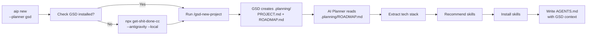

# AI Planner Local vs GSD (Get Shit Done) — So Sánh & Tích Hợp

## 1. Tổng Quan GSD

GSD là một **meta-prompting, context engineering & spec-driven development system** hoạt động như một skill/command layer bên trên các AI agents (Claude Code, Gemini CLI, Codex, Antigravity, Cursor, v.v.). Nó không phải CLI tool riêng biệt — nó **inject commands vào agent runtime** thông qua slash commands (`/gsd-*`).

**Cài đặt:** `npx get-shit-done-cc@latest` → chọn runtime + location → agent có thêm ~60 slash commands.

---

## 2. Bảng So Sánh Chi Tiết

### 2.1. Feature Overlap (Trùng lặp)

| Tính năng | AI Planner Local | GSD | Mức trùng lặp |
|:---|:---|:---|:---|
| **Project planning từ idea** | `aip new` → gstack 4-stage pipeline | `/gsd-new-project` → questions → research → requirements → roadmap | 🔴 **Cao** |
| **Existing project scanning** | `aip existing` → DeepWiki wiki + tech detection | `/gsd-map-codebase` → 4 parallel agents (stack, arch, conventions, concerns) | 🔴 **Cao** |
| **Tech stack detection** | `detectTechStack()` — package.json, config files | GSD Stack Mapper — deeper analysis, convention mapping | 🟡 **Trung bình** |
| **Machine readiness** | `aip doctor` — 10 checks | Không có — GSD giả định machine đã sẵn sàng | ⚪ **Không trùng** |
| **Skill management** | `aip skills` — recommend + install skills.sh | Không có — GSD dùng agent skills trực tiếp | ⚪ **Không trùng** |
| **Agent handoff** | `AGENTS.md` generation | `HANDOFF.json` + `continue-here.md` | 🟡 **Trung bình** |
| **Wiki generation** | DeepWiki integration — full wiki pages | Không có wiki — dùng codebase mapping artifacts | ⚪ **Không trùng** |

### 2.2. GSD Features mà AI Planner CHƯA CÓ

| GSD Feature | Mô tả | Giá trị cho AI Planner |
|:---|:---|:---|
| **Phase execution** | `/gsd-execute-phase` — parallel wave execution với fresh 200K context | ⭐⭐⭐⭐⭐ Rất cao |
| **Plan verification loop** | Planner → Plan Checker → loop 3x until pass | ⭐⭐⭐⭐⭐ Rất cao |
| **Code review pipeline** | `/gsd-code-review` → `/gsd-code-review-fix` → `/gsd-verify-work` | ⭐⭐⭐⭐ Cao |
| **UI design contract** | `/gsd-ui-phase` — 6-pillar design spec trước khi code | ⭐⭐⭐⭐ Cao |
| **Session management** | `/gsd-pause-work` + `/gsd-resume-work` — cross-session context | ⭐⭐⭐⭐ Cao |
| **Nyquist validation** | Auto-map test coverage → requirements trước khi code | ⭐⭐⭐⭐ Cao |
| **Multi-agent orchestration** | Specialized agents per stage (researcher, planner, executor, verifier) | ⭐⭐⭐⭐⭐ Rất cao |
| **Backlog & Seeds** | `/gsd-add-backlog`, `/gsd-plant-seed` — future-surfacing ideas | ⭐⭐⭐ Trung bình |
| **Workstreams** | Isolated `.planning/` state cho parallel milestone work | ⭐⭐⭐ Trung bình |
| **Git branching strategy** | Phase/milestone branch templates, atomic commits per task | ⭐⭐⭐⭐ Cao |
| **Autonomous mode** | `/gsd-autonomous --from 3 --to 7` — hands-free multi-phase | ⭐⭐⭐⭐ Cao |
| **Debug system** | `/gsd-debug` — persistent debugging state, systematic methodology | ⭐⭐⭐ Trung bình |
| **Codebase intelligence** | `/gsd-intel` — queryable index (APIs, deps, architecture decisions) | ⭐⭐⭐⭐ Cao |
| **Security hardening** | Prompt injection detection, path traversal prevention | ⭐⭐⭐ Trung bình |
| **Model profiles** | quality/balanced/budget/inherit per agent type | ⭐⭐⭐⭐ Cao |

### 2.3. AI Planner Features mà GSD CHƯA CÓ

| AI Planner Feature | Mô tả | Tại sao GSD không cần |
|:---|:---|:---|
| **Machine readiness (`aip doctor`)** | Check Node, Docker, env, LLM keys | GSD chạy bên trong agent, agent đã setup |
| **DeepWiki wiki generation** | Full markdown wiki từ repo | GSD dùng codebase mapping, không cần wiki riêng |
| **Skills ecosystem** | Crawl skills.sh, recommend, install | GSD dùng `agent_skills` config trực tiếp |
| **Multi-LLM provider abstraction** | Gemini/OpenAI/Claude/OpenRouter | GSD dựa vào runtime provider (Claude Code, Gemini CLI) |
| **Bootstrap automation** | `aip bootstrap` — auto-create env, start Docker | GSD giả định user đã có environment |
| **Web companion** | Optional Vite+React viewer | GSD hoàn toàn terminal-based |

---

## 3. Đánh Giá Kiến Trúc: Vì Sao GSD Mạnh Hơn Ở Planning


> [!IMPORTANT]
> **Sự khác biệt cốt lõi:** AI Planner dừng ở **kế hoạch + skills** (setup agent environment). GSD đi **end-to-end** từ idea → planning → execution → verification → shipping code. Đây KHÔNG phải overlap hoàn toàn — chúng bổ sung cho nhau.

---

## 4. Chiến Lược Tích Hợp: GSD Như Alternative Planning Engine

### 4.1. Ý tưởng: "Planning Engine" pluggable

Thay vì hardcode gstack, AI Planner cho phép chọn **planning engine**:

```text
aip new --planner gstack      # Current behavior (default)
aip new --planner gsd          # Use GSD planning pipeline  
aip new --planner direct       # Direct LLM fallback
```

Hoặc trong `.aiplanner.json`:
```json
{
  "defaultPlanner": "gsd",
  "defaultAgent": "antigravity",
  "preferredSkillsDirs": ["fixtures/local-skills"]
}
```

### 4.2. Cách tích hợp GSD cụ thể



### 4.3. Mapping GSD commands → AI Planner orchestration

| AI Planner hiện tại | GSD equivalent | Cách tích hợp |
|:---|:---|:---|
| `aip new` (planning) | `/gsd-new-project` + `/gsd-plan-phase` | AI Planner gọi GSD thay gstack |
| `aip existing` (scanning) | `/gsd-map-codebase` | AI Planner gọi GSD cho deep codebase analysis |
| Không có | `/gsd-execute-phase` | **MỚI**: `aip execute` gọi GSD execution |
| Không có | `/gsd-verify-work` | **MỚI**: `aip verify` gọi GSD verification |
| Không có | `/gsd-code-review` | **MỚI**: `aip review` gọi GSD code review |

### 4.4. Thiết kế interface cho Pluggable Planner

```typescript
// Proposed: packages/core/src/planners/types.ts
export interface PlannerEngine {
  id: string                              // 'gstack' | 'gsd' | 'direct-llm'
  name: string
  
  /** Check if the engine is installed and available */
  isAvailable(): Promise<boolean>
  
  /** Install the engine if missing */
  install(options: { agent: string; scope: 'global' | 'local' }): Promise<void>
  
  /** Run project planning pipeline */
  plan(input: PlannerInput): Promise<PlannerOutput>
  
  /** (Optional) Scan existing codebase */
  scanCodebase?(path: string): Promise<CodebaseScanResult>
  
  /** (Optional) Execute planned phases */
  execute?(phase: number): Promise<ExecutionResult>
}

export interface PlannerInput {
  description: string
  projectDir?: string
  promptFile?: string
  onProgress?: (progress: PlannerProgress) => void
}

export interface PlannerOutput {
  designDoc: string
  techStack: string[]
  architecture: string
  roadmap?: string            // GSD produces this, gstack doesn't
  phases?: PlannerPhase[]     // GSD produces structured phases
  artifacts: string[]         // Paths to generated files
}
```

---

## 5. Đánh Giá: Nên Thay gstack Hay Bổ Sung?

### So sánh trực tiếp gstack vs GSD cho planning

| Tiêu chí | gstack | GSD |
|:---|:---|:---|
| **Depth of planning** | 4 stages, single pass | Iterative: questions → research → requirements → phased roadmap |
| **Output structure** | Một design doc dài | PROJECT.md + REQUIREMENTS.md + ROADMAP.md + per-phase artifacts |
| **Plan verification** | ❌ Không có | ✅ Plan checker loop (3 iterations) |
| **Research before plan** | ❌ Không tách biệt | ✅ 4 parallel researchers (stack, features, arch, pitfalls) |
| **User input quality** | Freeform prompt | Structured questions + Socratic exploration |
| **Beyond planning** | ❌ Chỉ output text | ✅ Execute → Verify → Ship |
| **Brownfield support** | ❌ Không | ✅ `/gsd-map-codebase` → focused questions |
| **Scope management** | ❌ Không | ✅ Add/insert/remove phases, backlog, seeds |
| **Cost control** | ❌ Không | ✅ Model profiles (quality/balanced/budget) |
| **Multi-runtime** | ❌ gstack only | ✅ Claude Code, Gemini CLI, Codex, Antigravity, v.v. |

> [!TIP]
> **Kết luận: GSD nên là OPTION, không phải REPLACEMENT.**
> - gstack phù hợp cho **quick planning** khi chỉ cần design doc
> - GSD phù hợp cho **full lifecycle** khi cần plan → execute → verify
> - Direct LLM fallback phù hợp khi **không có tool nào available**

---

## 6. Implementation Plan — GSD Integration

### Phase 1: Pluggable Planner Architecture (1-2 tuần)

1. **Tạo `packages/core/src/planners/` module:**
   - `types.ts` — PlannerEngine interface
   - `gstack.ts` — wrap existing gstack orchestrator
   - `gsd.ts` — GSD integration via npx
   - `direct-llm.ts` — existing LLM fallback
   - `registry.ts` — planner registry & resolver

2. **Update `aip new` command:**
   - Thêm `--planner` flag
   - Đọc `defaultPlanner` từ `.aiplanner.json`
   - Render planner selection nếu không chỉ định

3. **Update `aip doctor`:**
   - Check GSD availability
   - Show available planners

4. **Update `aip bootstrap`:**
   - Install GSD nếu user chọn

### Phase 2: Deep GSD Integration (2-3 tuần)

1. **`aip existing --scanner gsd`:**
   - Gọi `/gsd-map-codebase` thay DeepWiki
   - Parse STACK.md, ARCHITECTURE.md output

2. **Mới: `aip execute`:**
   - Thin wrapper around GSD execution
   - Only available khi planner = gsd

3. **Mới: `aip verify`:**
   - Thin wrapper around GSD verification

### Phase 3: Unified Experience (2 tuần)

1. **`.aiplanner.json` extended config:**
   ```json
   {
     "defaultPlanner": "gsd",
     "defaultAgent": "antigravity",
     "gsd": {
       "mode": "interactive",
       "granularity": "standard",
       "modelProfile": "balanced"
     }
   }
   ```

2. **GSD artifacts → AI Planner pipeline:**
   - Read `.planning/ROADMAP.md` → extract tech stack
   - Read `.planning/phases/*/CONTEXT.md` → enrich skill recommendations
   - Map GSD phases → AGENTS.md context

---

## 7. Tổng Kết

```
┌─────────────────────────────────────────────────────────────┐
│                    AI Planner Local                         │
│                   (Orchestration Layer)                     │
│                                                             │
│  ┌──────────┐  ┌──────────┐  ┌──────────┐                 │
│  │  gstack  │  │   GSD    │  │ Direct   │  ← Pluggable    │
│  │ (quick)  │  │ (full)   │  │   LLM    │    Planners     │
│  └──────────┘  └──────────┘  └──────────┘                 │
│                                                             │
│  ┌──────────┐  ┌──────────┐  ┌──────────┐                 │
│  │ DeepWiki │  │   GSD    │  │  Local   │  ← Pluggable    │
│  │  (wiki)  │  │ (mapper) │  │  Scan    │    Scanners     │
│  └──────────┘  └──────────┘  └──────────┘                 │
│                                                             │
│  ┌──────────────────────────────────────┐                  │
│  │  Skills Engine (skills.sh + local)  │  ← Unique to AIP │
│  └──────────────────────────────────────┘                  │
│                                                             │
│  ┌──────────────────────────────────────┐                  │
│  │  Doctor + Bootstrap + Agent Handoff │  ← Unique to AIP │
│  └──────────────────────────────────────┘                  │
│                                                             │
└─────────────────────────────────────────────────────────────┘
```

> [!IMPORTANT]  
> **Giá trị cốt lõi của AI Planner là orchestration — kết nối các công cụ tốt nhất lại với nhau.** GSD là một planning engine cực kỳ mạnh, và AI Planner nên integrate nó như một **first-class option** bên cạnh gstack, chứ không phải replace hoàn toàn.

**Ưu tiên hành động:**
1. ✅ Thiết kế PlannerEngine interface
2. ✅ Wrap gstack hiện tại thành plugin
3. ✅ Thêm GSD plugin — `npx get-shit-done-cc --antigravity --local` + parse artifacts  
4. ✅ Cho user chọn planner trong `aip new` và `.aiplanner.json`
