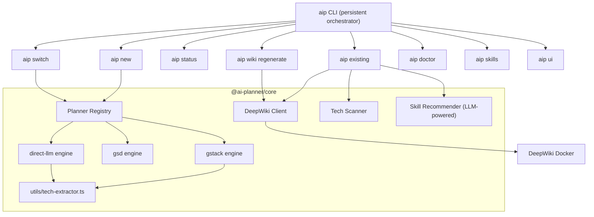

# AI Planner Local — Comprehensive Project Review
> Cập nhật: 2026-04-09 | Phiên bản tài liệu: v2.0

---

## I. Tổng quan & Giá trị mang lại

AI Planner Local giải quyết pain point lớn nhất của AI-assisted development hiện nay: **thiếu ngữ cảnh khi bắt đầu**. Khi dev mở agent (Gemini, Claude, Copilot…) ở một project mới, agent "mù" hoàn toàn — không biết stack, không biết architecture, không biết skill nào phù hợp. AI Planner giải quyết điều này qua pipeline:

```
init → analyze → equip → handoff → orchestrate
```

Triết lý cốt lõi: **AI Planner là orchestrator, không phải executor.** Nó thiết lập ngữ cảnh, cài công cụ đúng, sinh ra hướng dẫn rõ ràng — rồi trao quyền lại cho dev và agent của họ.

---

## II. Tính năng hiện có (Trạng thái: Production Ready)

### CLI Commands

| Command | Mô tả | Status |
|---|---|---|
| `aip new` | Plan project mới: chạy Planner, recommend skills, install, sinh `AGENTS.md`, hiện post-init menu | ✅ Stable |
| `aip existing <repo>` | Onboard project cũ: scan tech stack, DeepWiki wiki, recommend+install skills, sinh `AGENTS.md`, hiện post-init menu | ✅ Stable |
| `aip status` | Dashboard: hiện Planner, Agent, Wiki, Skills, Next step theo từng engine | ✅ Stable |
| `aip switch --planner <name>` | Đổi Planner hiện tại (gstack/gsd/direct-llm), tự update config + regenerate `AGENTS.md` | ✅ Stable |
| `aip wiki regenerate [dir]` | Sinh lại wiki cho project, hỗ trợ `--publish` để đẩy lên DeepWiki | ✅ Stable |
| `aip skills` | Quản lý agent skill: list, install, remove | ✅ Stable |
| `aip doctor` | Kiểm tra môi trường: API keys, Docker, tool dependencies | ✅ Stable |
| `aip bootstrap` | Tạo config ban đầu cho máy dev | ✅ Stable |
| `aip ui` | Khởi động companion web UI để xem wiki/artifact | ✅ Stable |

### Core Architecture



### Kiến trúc & Package structure

```
@ai-planner/core           — Logic trung tâm: planners, skills, deepwiki, scanner
@ai-planner/cli            — CLI entry point: commands, prompts, agent agent resolution
@ai-planner/web            — Web companion UI: artifact viewer, wiki browser
```

### Planner Engines

| Engine | Lý do dùng | Trạng thái |
|---|---|---|
| **gstack** *(default)* | YC-style 4-step planning pipeline, có fallback LLM khi `npx skills` fail | ✅ Stable + auto-fallback |
| **gsd** | Get Shit Done CC: cài GSD skills vào agent rồi để agent tự chạy `/gsd-new-project` | ✅ Stable |
| **direct-llm** | Gọi thẳng LLM qua OpenAI/Gemini API, không cần external tool | ✅ Stable |

### Dynamic AGENTS.md

`AGENTS.md` giờ sinh tự động và thay đổi theo Planner đã chọn:

| Planner | Nội dung AGENTS.md |
|---|---|
| gstack | Hướng dẫn `/office-hours`, `/plan-eng-review`, `/plan-ceo-review` |
| gsd | Hướng dẫn `/gsd-new-project --auto` với .planning/PROJECT.md |
| direct-llm | Hướng dẫn đọc `implementation_plan.md` và bắt đầu build |

### Post-Init Orchestrator Menu

Sau khi `aip new` hoặc `aip existing` chạy xong, CLI không exit ngay mà hiện menu:
```
? What would you like to do next?
  ❯ View project status
    Exit and start building
```

---

## III. Đánh giá gstack & GSD — Hiện tại

### gstack

| Tiêu chí | Đánh giá | Ghi chú |
|---|---|---|
| Installation | ⚠️ Trung bình | Phụ thuộc `npx skills` CLI → hay timeout |
| Plan execution | ✅ Khá tốt | 4-step pipeline + auto-fallback sang direct-llm |
| Post-init handoff | ✅ Đã fix | AGENTS.md có hướng dẫn rõ ràng theo gstack |
| Switch runtime | ✅ Có | `aip switch --planner gsd` hoạt động ngay |

### GSD

| Tiêu chí | Đánh giá | Ghi chú |
|---|---|---|
| Installation | ✅ Tốt | `npx get-shit-done-cc@latest` nhanh, hỗ trợ nhiều agent |
| `isAvailable()` | ✅ Đã fix | Giờ check `npx --version` thực tế thay vì `return true` |
| Post-init handoff | ✅ Khá | AGENTS.md hướng dẫn `/gsd-new-project --auto` |
| Real planning | ⚠️ Stub | GSD scaffold `.planning/PROJECT.md` rồi để agent chạy tiếp |

---

## IV. Technical Debt — Đã giải quyết

| Issue | File gốc | Resolution |
|---|---|---|
| Code duplicate `extractPlanningTech()` | `gstack.ts`, `direct-llm.ts`, `new.ts` | ✅ Extract vào `core/src/utils/tech-extractor.ts` |
| Code duplicate `extractSection()` | `gstack.ts`, `direct-llm.ts`, `new.ts` | ✅ Cùng file trên |
| Hardcoded `'gstack'` trong API server | `server.ts` | ✅ Đọc dynamically từ `.aiplanner.json` |
| GSD `isAvailable()` always `true` | `gsd.ts` | ✅ Kiểm tra `npx` thực tế |
| Post-init không có menu | `new.ts`, `existing.ts` | ✅ Interactive menu với inquirer |
| `AGENTS.md` static, không theo planner | `handoff.ts` | ✅ Dynamic theo `plannerMode` |

---

## V. Roadmap — Tương lai

### P2: Plugin & Extensibility (Tiếp theo)

#### 5.1 Plugin ecosystem — Community đóng góp Planner
Mở rộng `registry.ts` để load planner từ npm packages:
```json
// .aiplanner.json
{
  "plugins": ["@my-team/custom-planner", "@cursor/planner-engine"],
  "defaultPlanner": "my-custom-planner"
}
```
Giá trị: Cộng đồng có thể đóng góp engine tích hợp Cursor AI, Windsurf, Zed, Bolt, v.v.

#### 5.2 `aip scaffold` — Tạo folder structure từ plan
```bash
aip scaffold --from implementation_plan.md
# → Creates src/, tests/, configs based on architecture section
```
Giá trị: Tiết kiệm 30+ phút setup boilerplate sau khi có plan.

#### 5.3 `aip context export` — Di chuyển giữa AI agents
```bash
aip context export --from gemini --to claude
# → Migrates .gemini/ skills → .claude/, rewrites AGENTS.md conventions
```
Giá trị: Dev có thể thử nghiệm nhiều agent khác nhau mà không mất context.

---

### P3: Intelligence Layer

#### 6.1 `aip diff` — Plan vs Reality
```bash
aip diff --plan implementation_plan.md
# → Compares planned architecture vs what's actually in src/
```

#### 6.2 `aip skills search <query>` — Tìm skill theo context
```bash
aip skills search "how to handle drizzle migrations"
# → Searches installed + community skill registry, ranks by relevance
```

#### 6.3 Auto-suggest khi context thay đổi
Khi dev thêm thư viện mới vào `package.json`, `aip` có thể detect và suggest skill bổ sung:
```
ℹ️ Detected new dependency: @stripe/stripe-js
   → Suggest installing skill: stripe-payments [wshobson/agents]
```

---

### P4: Multi-project & Team Features

#### 7.1 `aip workspace` — Quản lý nhiều repo
```bash
aip workspace add ./api ./web ./mobile
aip workspace status  # cross-repo status dashboard
```

#### 7.2 Shared skill registry (team-level)
Team có thể dùng URL dẫn đến private skill registry:
```json
{
  "preferredSkillsDirs": [
    "https://company.ai/skills",
    "local/user-skills"
  ]
}
```

#### 7.3 `aip doctor --ci` — CI/CD readiness check
Chạy trong pipeline để đảm bảo agent environment đã được setup đúng trước khi merge.

---

## VI. Tích hợp AI Tooling tương lai

| Tool / Platform | Cách tích hợp | Priority |
|---|---|---|
| **Cursor AI** | Plugin planner, đọc `.cursor/rules/` | P2 |
| **Windsurf (Codeium)** | Plugin planner, cài Windsurf-specific skills | P2 |
| **GitHub Copilot** | Sync `AGENTS.md` format với Copilot Instructions | P2 |
| **Bolt.new / v0** | Export plan thành prompt format phù hợp | P3 |
| **Continue.dev** | Plugin planner, context injection vào `.continue/` | P3 |
| **MCP (Model Context Protocol)** | Expose AI Planner state qua MCP server cho agent đọc trực tiếp | P2 🔥 |
| **Aider** | Tích hợp `CONVENTIONS.md` + session context | P3 |
| **OpenCode** | Planner plugin + `/office-hours` flow | P2 |

> [!IMPORTANT]
> **MCP integration là cơ hội lớn nhất**: Bằng cách expose AI Planner state qua MCP server, bất kỳ agent hỗ trợ MCP (Claude, Gemini, Copilot...) đều có thể đọc project context, skills, plan — mà không cần đọc file thủ công.

---

## VII. Tổng kết Priority Matrix (cập nhật)

| # | Feature | Impact | Effort | Status |
|---|---|---|---|---|
| 1 | Post-init menu + `aip status` | 🔥🔥🔥 | Thấp | **✅ DONE** |
| 2 | Dynamic AGENTS.md theo planner | 🔥🔥🔥 | Thấp | **✅ DONE** |
| 3 | Fix API hardcoded gstack | 🔥🔥 | Rất thấp | **✅ DONE** |
| 4 | `aip wiki regenerate` | 🔥🔥 | Trung bình | **✅ DONE** |
| 5 | `aip switch --planner` | 🔥🔥 | Trung bình | **✅ DONE** |
| 6 | Extract tech-extractor utils | 🔥 | Thấp | **✅ DONE** |
| 7 | GSD `isAvailable()` fix | 🔥🔥 | Thấp | **✅ DONE** |
| 8 | MCP server exposure | 🔥🔥🔥 | Cao | **P2 — Next** |
| 9 | Plugin ecosystem (npm planner) | 🔥🔥🔥 | Cao | **P2** |
| 10 | `aip scaffold` from plan | 🔥🔥 | Cao | **P2** |
| 11 | `aip context export` migration | 🔥🔥 | Cao | **P3** |
| 12 | `aip diff` plan vs reality | 🔥🔥 | Trung bình | **P3** |
| 13 | Cursor/Windsurf planner plugin | 🔥🔥🔥 | Cao | **P2** |
| 14 | Team shared skill registry | 🔥🔥 | Trung bình | **P4** |

---

> [!NOTE]
> **Triết lý nhất quán**: AI Planner sẽ luôn là **CLI-first, local-first, orchestrator-first**. Không phụ thuộc cloud. Không lock-in vào một agent. Trao quyền tối đa cho dev và công cụ họ đã chọn.
