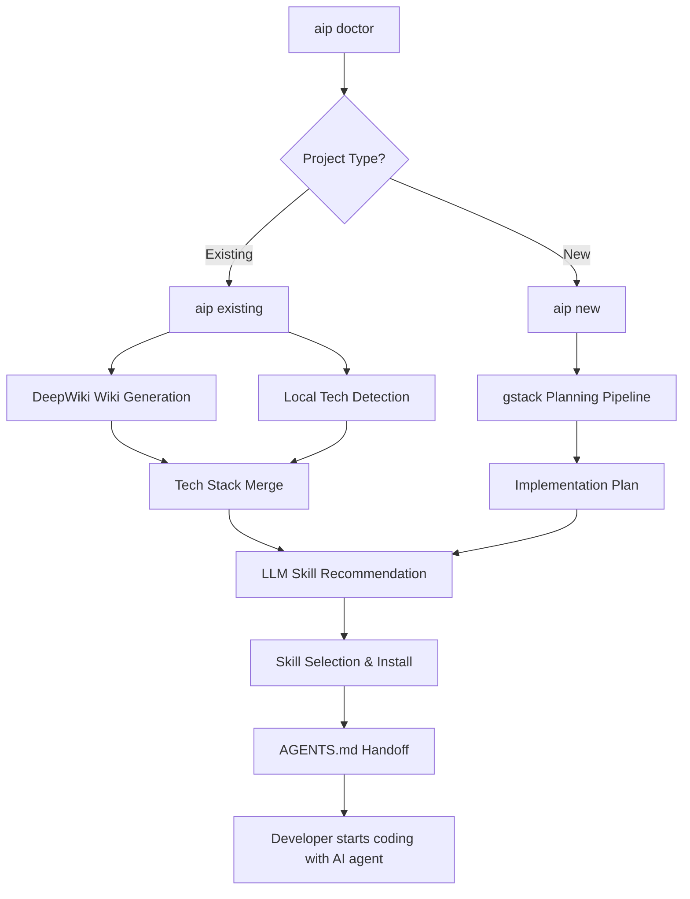
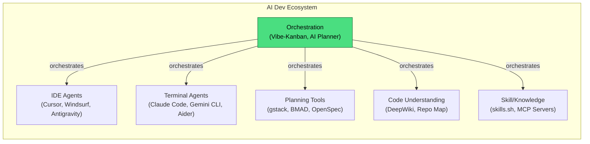
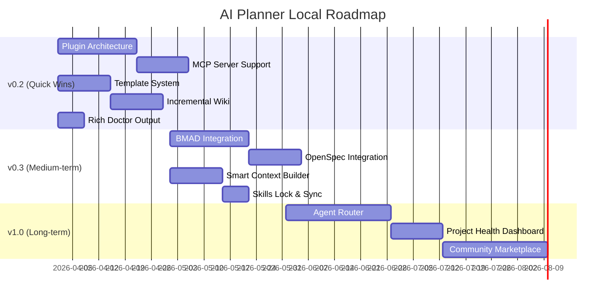

# AI Planner Local — Tổng Quan Dự Án & Đề Xuất Cải Tiến

## 1. Những Gì Đã Đạt Được

### 1.1. Product Vision đã rõ ràng và khác biệt

AI Planner Local đã giải quyết được một **pain point thực tế**: developer mất quá nhiều thời gian để bootstrap dự án mới hoặc onboard vào codebase có sẵn khi làm việc với AI agents. Thay vì phải tự ráp nối DeepWiki + gstack + skills.sh bằng tay, dự án gom tất cả vào **một CLI flow duy nhất**.

| Thành tựu | Chi tiết |
|:---|:---|
| **CLI-first architecture** | 6 commands hoàn chỉnh: `bootstrap`, `doctor`, `existing`, `new`, `skills`, `ui` |
| **Machine readiness** | 10 checks tự động (Node, npm, Docker, Docker daemon, workspace write, .env, LLM config, skills CLI, agent access, gstack, DeepWiki) |
| **DeepWiki integration** | Wiki generation cho local repo với streaming pipeline hoàn chỉnh, page-by-page generation, persistent artifacts |
| **Multi-LLM support** | 4 providers (Gemini, OpenAI, Claude, OpenRouter) với fallback chain |
| **Intelligent skill recommendation** | LLM-powered + heuristic fallback, local/remote skill merge, duplicate avoidance |
| **gstack planning pipeline** | 4-stage planning (office-hours → ceo-review → eng-review → design-review) với direct LLM fallback |
| **Agent handoff** | Auto-generate `AGENTS.md` với full project context cho agent tiếp theo |
| **Local skill sources** | Support team/personal skill libraries qua `.aiplanner.json` |
| **Test infrastructure** | Core tests + CLI regression tests + manual smoke tests với fixtures |

### 1.2. Dòng chảy chính hoạt động end-to-end



### 1.3. Kiến trúc hiện tại

```text
packages/
├─ core/          # ~2,300 LOC TypeScript
│  ├─ agent/      # Agent handoff & AGENTS.md generation
│  ├─ config/     # .aiplanner.json loader
│  ├─ deepwiki/   # DeepWiki Open streaming client (539 lines)
│  ├─ env/        # doctor & bootstrap (450 lines)
│  ├─ gstack/     # Planning pipeline orchestrator (311 lines)
│  ├─ llm/        # Multi-provider LLM client (196 lines)
│  ├─ scanner/    # Tech stack detector (134 lines)
│  └─ skills/     # Crawler, recommender, CLI wrapper, local dir
├─ cli/           # ~800 LOC - Commander.js commands
│  └─ commands/   # bootstrap, doctor, existing, new, skills, ui
└─ web/           # Optional Vite+React companion (minimal)
```

---

## 2. Đánh Giá Khả Năng Mở Rộng

### 2.1. Điểm mạnh kiến trúc

| Khía cạnh | Đánh giá | Ghi chú |
|:---|:---|:---|
| **Monorepo structure** | ✅ Tốt | `packages/core` tách biệt logic, dễ thêm package mới |
| **Module separation** | ✅ Tốt | Mỗi domain (deepwiki, gstack, skills, llm) có module riêng |
| **Type safety** | ✅ Tốt | TypeScript end-to-end với shared types |
| **LLM abstraction** | ✅ Tốt | Multi-provider với fallback chain, dễ thêm provider mới |
| **Skill ecosystem** | ✅ Tốt | Local + remote + installed separation rõ ràng |

### 2.2. Điểm cần cải thiện để mở rộng

> [!WARNING]
> Các điểm dưới đây **không phải lỗi** mà là **bottleneck khi scale** — cần giải quyết trước khi thêm tính năng lớn.

| Khía cạnh | Vấn đề | Tác động |
|:---|:---|:---|
| **Plugin architecture** | ❌ Chưa có | Mỗi integration mới (ví dụ BMAD, OpenSpec) phải sửa core code |
| **Event/Hook system** | ❌ Chưa có | Không thể hook vào lifecycle stages (pre-scan, post-plan, pre-install) |
| **MCP support** | ❌ Chưa có | Thiếu chuẩn kết nối MCP — chuẩn hóa tool interop đang thống trị ecosystem |
| **CLI extensibility** | ⚠️ Hạn chế | Thêm command mới phải sửa `index.ts` và build lại |
| **Config schema** | ⚠️ Đơn giản | `.aiplanner.json` chỉ có `preferredSkillsDirs` + `defaultAgent` |
| **Error recovery** | ⚠️ Cơ bản | Retry logic chỉ ở level fallback, chưa có structured retry |
| **Caching** | ⚠️ In-memory only | Skills cache 24h nhưng mất khi restart, wiki không cache |
| **Telemetry/Analytics** | ❌ Chưa có | Không biết user dùng flows nào, fail ở đâu |

---

## 3. Vị Trí Trong Landscape AI Tooling 2025–2026



> [!IMPORTANT]
> **AI Planner Local nằm ở vị trí "Orchestration layer"** — đây là vị trí chiến lược nhất vì nó kết nối tất cả các tool khác lại. Nhưng để giữ vị trí này, cần mở rộng để hỗ trợ nhiều công cụ hơn ngoài DeepWiki + gstack.

---

## 4. Đề Xuất Cải Tiến — Ngắn Hạn (v0.2)

### 4.1. Plugin Architecture

Thay vì hardcode mỗi integration, tạo hệ thống plugin cho phép cộng đồng đóng góp:

```typescript
// Proposed: packages/core/src/plugins/types.ts
export interface AIPlannerPlugin {
  id: string
  name: string
  version: string
  
  // Lifecycle hooks
  onDetectTech?: (context: ScanContext) => Promise<string[]>
  onPlan?: (context: PlanContext) => Promise<PlanningResult>
  onRecommendSkills?: (context: RecommendContext) => Promise<SkillRecommendation[]>
  onPostInstall?: (context: InstallContext) => Promise<void>
  
  // CLI extensions
  commands?: CommandDefinition[]
}
```

**Lợi ích:**
- Cộng đồng có thể thêm support cho tool mới mà không fork core
- Dễ dàng enable/disable từng integration
- `.aiplanner.json` có thể khai báo plugins cần dùng

### 4.2. MCP Server Support

MCP (Model Context Protocol) đã trở thành chuẩn công nghiệp. AI Planner nên:

1. **Expose chính nó như một MCP Server** — cho phép Claude Code, Gemini CLI, Cursor gọi AIP commands trực tiếp
2. **Consume MCP Servers** — tự động phát hiện và sử dụng MCP servers có sẵn trong project

```text
# Proposed new command
aip mcp serve        # Expose AIP as MCP server
aip mcp list         # List available MCP servers in project
aip mcp install      # Install MCP server configs
```

### 4.3. Template System cho `aip new`

Hiện tại `aip new` bắt đầu từ prompt trắng. Thêm templates:

```text
aip new --template saas-nextjs
aip new --template cli-tool
aip new --template api-fastapi
aip new --template monorepo-fullstack
```

Mỗi template bao gồm:
- Pre-filled prompt với best practices
- Recommended tech stack
- Pre-selected skills
- Scaffold files

### 4.4. Cải thiện `aip existing` — Incremental Wiki

Vấn đề: Wiki generation mất nhiều thời gian và tạo lại từ đầu mỗi lần.

Giải pháp:
- **Incremental updates**: Chỉ regenerate pages bị thay đổi (dựa trên git diff)
- **Wiki versioning**: Lưu timestamp, cho phép diff giữa các lần scan
- **Selective page generation**: Chỉ generate pages cho subsystem đang làm việc

### 4.5. Rich Doctor Output

Nâng cấp `aip doctor` từ pass/fail list thành interactive diagnostic:

```text
AI Planner Local - Machine Readiness Report
━━━━━━━━━━━━━━━━━━━━━━━━━━━━━━━━━━━━

  ✅ Node.js 22.5.0         ✅ npm 10.8.0
  ✅ Docker 27.3.1           ✅ Docker daemon running  
  ✅ .env configured         ✅ Gemini + OpenAI ready
  ⚠️  DeepWiki not running   → Run: docker compose up -d
  ⚠️  gstack not installed   → Run: aip bootstrap

  Overall: READY (2 warnings)
  
  Estimated capabilities:
  ├─ aip existing  ✅ Full (wiki + tech + skills)
  ├─ aip new       ⚠️  Limited (using LLM fallback)
  └─ aip skills    ✅ Full
```

---

## 5. Đề Xuất Cải Tiến — Trung Hạn (v0.3)

### 5.1. BMAD Integration

BMAD (Breakthrough Method for Agile AI-Driven Development) mang đến structured SDLC cho AI dev:

```text
aip new --method bmad
```

- Tích hợp BMAD personas (Analyst, Architect, PM, QA) vào planning pipeline
- Generate structured artifacts (PRD, Architecture Doc, Test Plan) thay vì free-form design doc
- Scale-adaptive: quick flow cho bug fix, full lifecycle cho MVP

### 5.2. OpenSpec Integration  

OpenSpec đảm bảo AI alignment thông qua spec-driven development:

```text
aip spec create     # Create spec from requirements
aip spec apply      # Generate implementation from spec
aip spec archive    # Archive completed specs
```

### 5.3. Vibe-Kanban Integration

Cho phép visual management khi chạy nhiều AI agents song song:

```text
aip kanban          # Open Kanban board for current project
aip kanban add      # Add task from implementation plan
```

### 5.4. Smart Context Builder

Tự động tạo optimal context package cho bất kỳ AI agent nào:

```typescript
// aip context build --for claude-code
// Output: .ai-planner/context/
//   ├─ project-summary.md    (architecture overview)
//   ├─ relevant-files.md     (file map + key snippets)
//   ├─ active-plan.md        (current implementation plan)
//   └─ conventions.md        (coding standards + patterns)
```

### 5.5. Persistent Skill Lock & Sync

Mở rộng `skills-lock.json` thành tool đồng bộ team-wide:

```text
aip skills sync       # Sync skills from lock file
aip skills lock       # Update lock file from current state
aip skills diff       # Show diff between lock and installed
```

---

## 6. Đề Xuất Cải Tiến — Dài Hạn (v1.0)

### 6.1. Agent Router

Tự động chọn AI agent phù hợp nhất cho từng task:

```text
aip route "refactor authentication module"
→ Recommended: Claude Code (complex multi-file refactor)
→ Alternative: Aider (git-native, smaller change scope)
```

### 6.2. Project Health Dashboard

CLI-based project health monitoring:

```text
aip health
━━━━━━━━━━━━━━━━━━
Wiki freshness:        ⚠️ 5 days old (12 files changed since last scan)
Skills coverage:       ✅ 8/10 tech stack areas covered
Plan progress:         🔄 Phase 2/4 (engineering review)
Agent readiness:       ✅ Full capability
Recommendation:        → Run `aip existing .` to refresh wiki
```

### 6.3. Community Skill Marketplace

Cho phép publish/share custom skills:

```text
aip skills publish ./my-skill    # Publish to community
aip skills browse                # Browse community skills
aip skills rate <skill-id>       # Rate a skill
```

---

## 7. Tóm Tắt Ưu Tiên



---

## 8. Kết Luận

> [!TIP]
> **Core strength**: AI Planner Local đã có nền tảng vững chắc với CLI-first philosophy, modular architecture, và end-to-end flows hoạt động. Nó đã giải quyết được friction chính: đi từ repo/idea → agent-ready environment trong vài commands.

> [!IMPORTANT]
> **Critical gap**: Thiếu **plugin architecture** và **MCP support** — hai thứ này là bắt buộc để dự án có thể scale theo tốc độ phát triển của AI tooling ecosystem. Nếu không có, mỗi integration mới sẽ yêu cầu sửa core code, làm chậm velocity.

**Top 3 priorities:**
1. 🔌 **Plugin Architecture** — Mở cửa cho community contributions
2. 🔗 **MCP Server/Client** — Trở thành first-class citizen trong AI tool ecosystem  
3. 📋 **Template System** — Giảm thời gian khởi tạo project từ phút xuống giây
